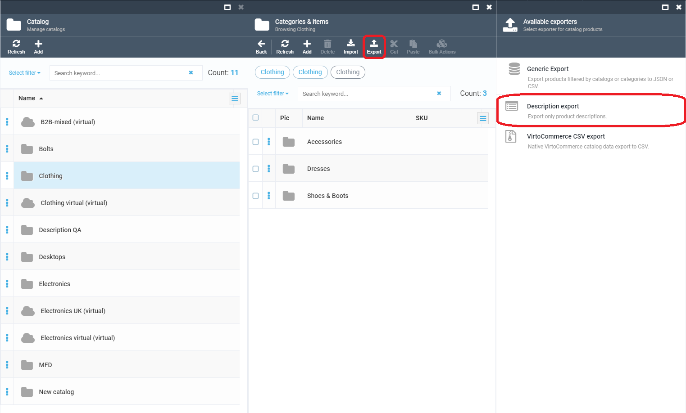

## 01. Overview

This module allows store managers to manage the product catalog without using the database requests approach. In 1.0 release only the products descriptions export/import is implemented.

> Note If you want to automated transferring information from 3rd party system, like ERP, then see API, Integration Middleware approach and Azure Logic Apps connectors.

## 02. Business scenarios

* I need to export products descriptions to edit and update.
* I need to import new or updated products descriptions to product catalog.

## 03. Work with module

### Export selected descriptions:
1. Go to Virto Commerce platform.
2. Open any category inside the Catalog module.
3. To export all descriptions of all products with descriptions in the current category, click "Export" on the toolbar.
4. Use "Description export" on the "Available exporters" blade.

5. If you want to export only descriptions in selected categories or selected products descriptions, just select them or use filters to refine.

### Import descriptions:
1. Go to Virto Commerce platform.
2. Open any category inside the Catalog module.
3. To import descriptions, click "Import" on the toolbar.
4. Use "Description import" on the "Available importers" blade.

### Create & update descriptions during the import process:
<table>
    <tr>
        <th>Description Id</th>
        <th>SKU</th>
        <th>Action</th>
    </tr>
    <tr>
        <th align="left">specified in the file, exists in the database</th>
        <th align="left">SKU value will be ignored</th>
        <th align="left">update</th>
    </tr>
    <tr>
        <th align="left">specified in the file, not exists in the database</th>
        <th align="left">specified in the file, exists in the database</th>
        <th align="left">create</th>
    </tr>
    <tr>
        <th align="left">specified in the file, not exists in the database (or not specified in the file)</th>
        <th align="left">specified in the file, not exists in the database (or not specified in the file)</th>
        <th align="left">no action</th>
    </tr>
</table>

## 04. CSV file requirements

1. Only semicolon-separated value CSV files are accepted.
2. The first line of the imported CSV file must contains next headers:
    - Product SKU (if Description Id is not specified)
    - Description Id (if Product SKU is not specified)
    - Description Content
    - Type
    - Language

You can use this [template](media/samples/Descriptions_import_sample.csv) for the import of products descriptions, or you can use the exported descriptions CSV file as a template.

